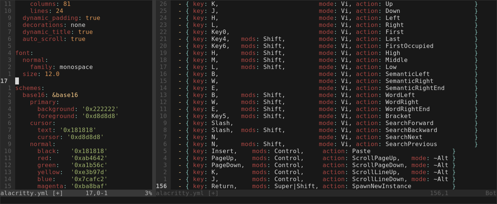

# What is Ricing?

## What is Ricing?

> "Rice" is a word that is commonly used to refer to making visual improvements
> and customizations on one's desktop. It was inherited from the practice of
> customizing cheap Asian import cars to make them appear to be faster than they
> actually were - which was also known as "ricing".
- [/r/unixporn][unixporn]


## Why Rice your computer

Why not? I like to be as productive as possible and to do that I like to
customize every little aspect of the way my computer works.

We live in a world where technology is streamlined and uniform for everyone,
your twitter profile is exactly the same as anyone else's, your windows
computer looks exactly the same as any other, at most you can customize some
colours or the wallpaper, but that just isn't enough to make a unique and
personal experience.


## How to Rice

At it's heart it's a simple process, you install a program, look at what
configuration options it allows for and you customize that program.

Repeat until you get that perfect _rice_.



_A bit of my alacritty config file_


# Examples

<div class="notes">
Now to explain what kinds of things this can affect, I will show two examples of
the things I use this freedom for.
</div>

## Window managers

There are 2 main kinds of window managers:

<div class="fragment">
- Floating window managers, which are what you're used to on Windows or MacOS.
</div>
<div class="fragment">
- Titling window managers, which are based on the concept that you screen should
    always be as full as possible.
</div>

<div class="fragment">
This works by making the first window you open full screen and the subsequent
windows split the space of the current window in half.
</div>

<div class="r-stack" >
<div class="fragment">
<svg width="400px" height="225px">
    <rect
        width="400px"
        height="225px"
        style="fill:#337dff;stroke-width:3;stroke:rgb(0,0,0)"
    />
    <image
        x="150px"
        y="50px"
        href="./img/firefox.png"
        height="100px"
        width="100px"
    />
</svg>
</div>
<div class="fragment">
<svg width="400px" height="225px">
    <rect
        width="200px"
        height="225px"
        style="fill:#337dff;stroke-width:3;stroke:rgb(0,0,0)"
    />
    <image
        x="50px"
        y="50px"
        href="./img/firefox.png"
        height="100px"
        width="100px"
    />
    <rect
        x="200px"
        width="200px"
        height="225px"
        style="fill:rgb(240, 71, 71);stroke-width:3;stroke:rgb(0,0,0)"
    />
    <image
        x="250px"
        y="50px"
        href="./img/bash.png"
        height="100px"
        width="100px"
    />
</svg>
</div>
<div class="fragment">
<svg width="400px" height="225px">
    <rect
        width="200px"
        height="225px"
        style="fill:#337dff;stroke-width:3;stroke:rgb(0,0,0)"
    />
    <image
        x="50px"
        y="50px"
        href="./img/firefox.png"
        height="100px"
        width="100px"
    />
    <rect
        x="200px"
        width="200px"
        height="127px"
        style="fill:rgb(240, 71, 71);stroke-width:3;stroke:rgb(0,0,0)"
    />
    <image
        x="250px"
        y="10px"
        href="./img/bash.png"
        height="100px"
        width="100px"
    />
    <rect
        x="200px"
        y="114px"
        width="200px"
        height="127px"
        style="fill:rgb(67, 181, 129);stroke-width:3;stroke:rgb(0,0,0)"
    />
    <image
        x="250px"
        y="120px"
        href="./img/vim.png"
        height="100px"
        width="100px"
    />
</svg>
</div>
</div>

## Automation

When remote classes started I had a recurring problem. I kept forget to actually
attend classes. So I thought of setting up reminders, but that just wasn't
enough and I had another idea.

```sh
#!/bin/bash
export DISPLAY=:0
CLASSES="
Mon:09:30|ACIC|https://videoconf-colibri.zoom.us/j/ID?pwd=PASS
Tue:08:00|ACIC|https://videoconf-colibri.zoom.us/j/ID?pwd=PASS
Thu:17:00|CSF |https://videoconf-colibri.zoom.us/j/ID?pwd=PASS
Fri:15:00|Port|https://videoconf-colibri.zoom.us/j/ID
"
date_str="$(date '+%a:%H:%M' | sed 's/.$//g')"
if class="$(echo "$CLASSES" | grep "$date_str.|")"; then
    name="$(echo "$class" | cut -d'|' -f2)"
    link="$(echo "$class" | cut -d'|' -f3)"
    notify-send "Joining $name" -a "$(basename "$0")" -u critical
    firefox "$link" &
fi
```

# Community

## Community

<div style="display:flex">
<div style="width: 60%">
As with any other hobby, there is a community around it and this is community is
based on sharing knowledge. Much like the open source movement. So almost
everyone has their configuration files on github or gitlab for others to see and
copy ideas from.
</div>

</div>


# _my rice_ {data-background-image="./img/curr_rice.gif"}

<div class="notes">

E interessante ter de configurar coisas que as pessoas tem por garantido

Ricing a linux desktop
- Configurar coisas que normalmente sao dadas como garantidas
- fazer o meu proprio music player sem querer
- Don't like it change it


- open source
- perda de tempo que vale a pena
</div>


[unixporn]: https://www.reddit.com/r/unixporn/wiki/themeing/dictionary#wiki_rice
